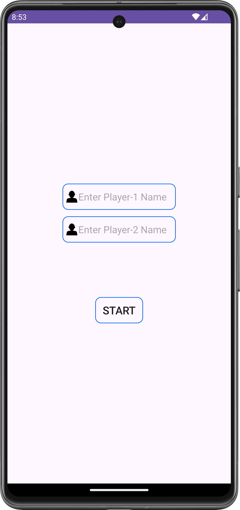
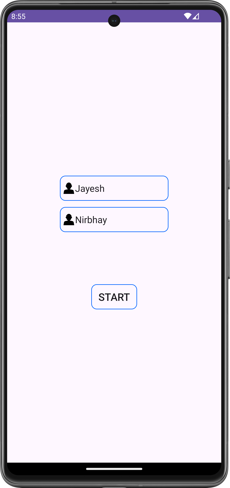
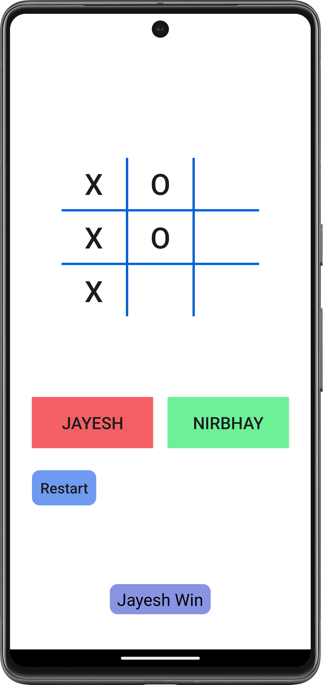

# Tic Tac Toe Android App

## Introduction

Welcome to the Tic Tac Toe Android app! This is a basic implementation of the classic Tic Tac Toe game for Android devices. The game supports two players and provides a simple user interface for an enjoyable gaming experience.

## Features

- **Player Names:** Customize player names before starting the game.
- **Restart Functionality:** Easily restart the game at any time.
- **Toast Messages:** Receive informative toast messages for game status updates.

## Getting Started

To get started with the Tic Tac Toe app, follow these steps:

1. Clone the repository to your local machine:

   ```bash
   git clone https://github.com/gojiyajayesh/tic-tac-toe.git
   ```

2. Open the project in Android Studio.

3. Build and run the application on an Android emulator or device.

## How to Play

1. Launch the app and enter the names of Player 1 and Player 2.

2. Press the "Start" button to begin the game.

3. Players take turns clicking on the empty spaces to place their marks (X or O).

4. The game ends when one player gets three of their marks in a row (horizontally, vertically, or diagonally) or when all spaces are filled without a winner.

5. Press the "Restart" button to start a new game.

## Screenshots
<div style="display: flex; gap: 10px;">
  
  
  
</div>
